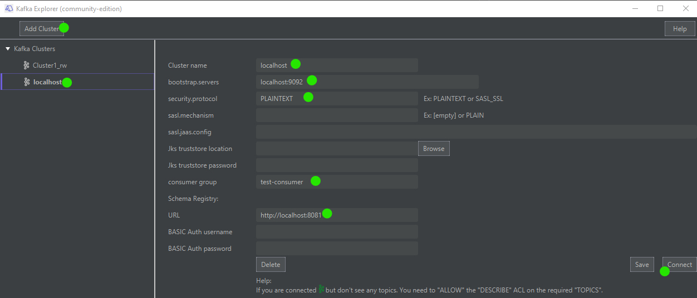

<p align="center">

<br />
<a href='https://ko-fi.com/B0B132J1L' target='_blank'></a>
</p>


# Kafkaexplorer (community-edition) 

A free, easy, straight to the point, **graphical tool** to explore Kafka topics and produce messages.
Fully integrated with [Confluent Schema Registry](https://docs.confluent.io/platform/current/schema-registry/index.html) for  [AVRO schemas](https://json-schema.org/) and [JSON schemas](https://json-schema.org/) on the fly deserialization.
Working on **Windows** and **MacOs**. Based on [JavaFx](https://en.wikipedia.org/wiki/JavaFX).


## Screenshots 


## Features

- List/search Kafka topics (hide internal topics starting by "_")
- Describe topics:
  - See partitions information (leader, replicas, inSynReplica)
  - See properties (like retention.ms and retention.bytes)

- Consume messages "from the beginning" or "latest". For each message, see: partition, offset, schema Id, schema subject and message content.

- Produce String messages into topics

- Schema Registry integration to get schemas and deserialize AVRO and JSON Schema messages.
  
- Supported security protocols: 
  - None
  - SASL_SSL and mechanism: PLAIN 
  - JKS truststore support 
    


Have questions? [Q&A section](https://github.com/stephaneuh/kafkaexplorer/discussions/categories/q-a).


## How to install

Download and install the latest version:

- Windows: [Kafkaexplorer_1.1.exe](/releases/Kafkaexplorer_1.1.exe)
- MacOs: [Kafkaexplorer_1.1.dmg](/releases/Kafkaexplorer_1.1.dmg)

## How to connect to a Kafka cluster

- Click on "Add Cluster"
- Select the "New Cluster" in the list
- Enter the connection information
- Save


## How to build/package/run from sources

Simply execute:

```
mvn javafx:run
```